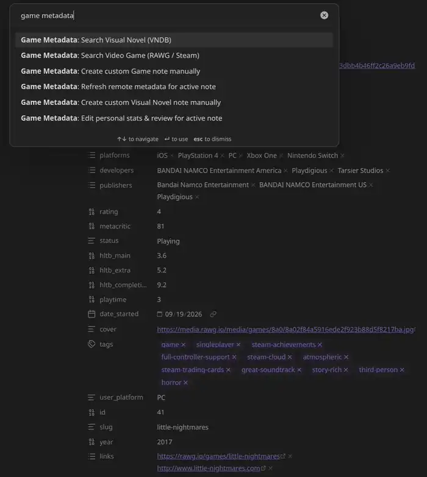
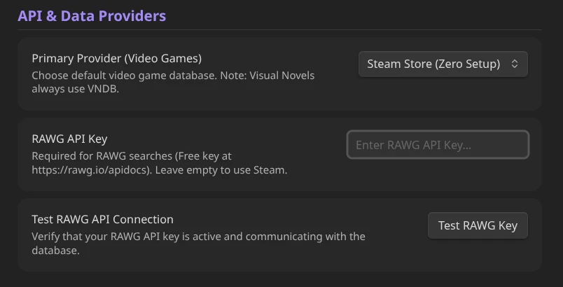
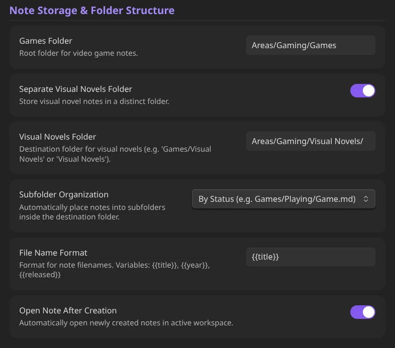
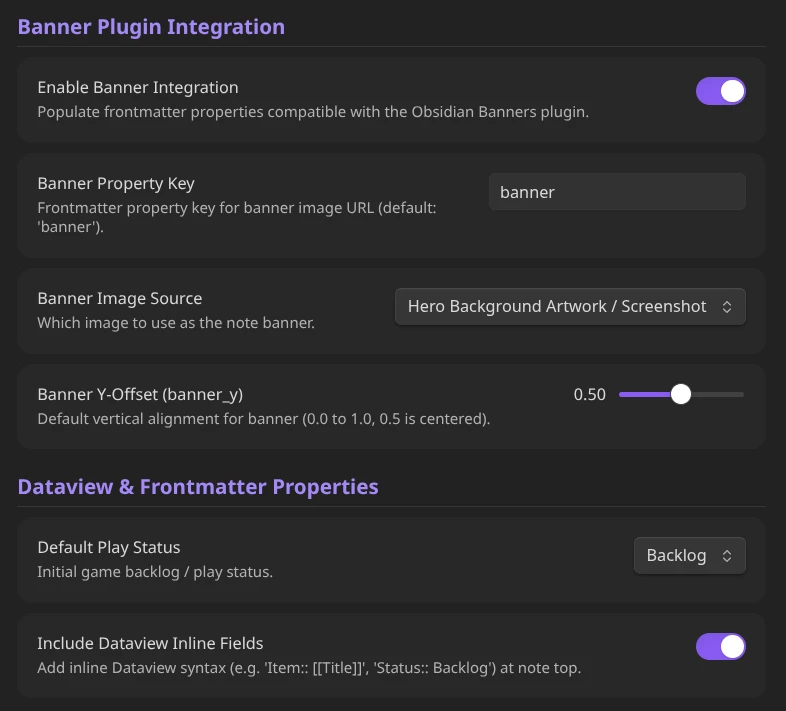
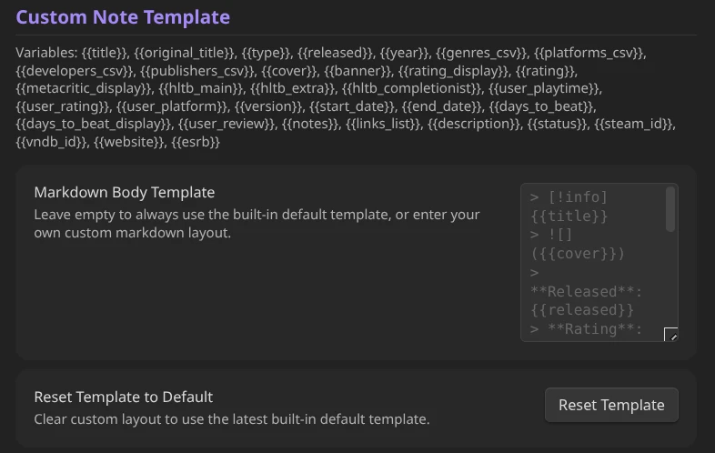
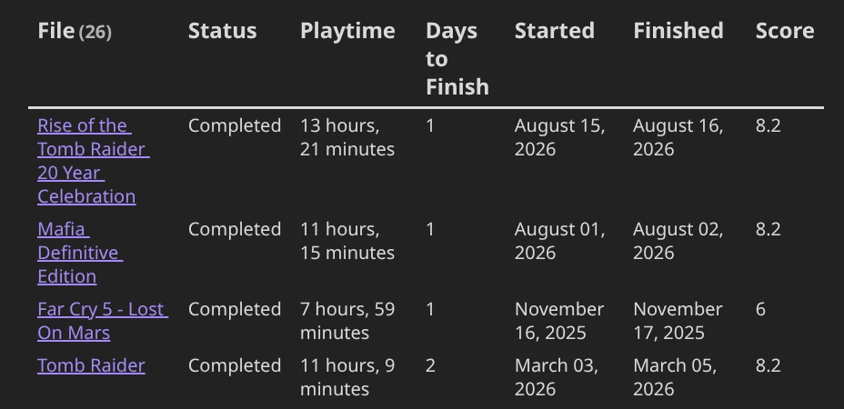
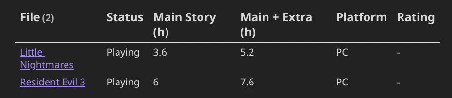

# obsidian-game-metadata
  A comprehensive Obsidian plugin to search video game and visual novel databases (**RAWG**, **Steam**, **VNDB**, and **HowLongToBeat**), retrieve rich metadata, cover & banner artwork, completion durations, ratings, and descriptions, for multiple platforms, and embed them into your vault with [Banners](https://community.obsidian.md/plugins/obsidian-banners), [Dataview](https://community.obsidian.md/plugins/dataview), and **Configurable Subfolder Hierarchy** support.

<p align="center">

 
      

  
</p>
<p align="center">

</p>

---
## Features

- **Video Games (RAWG & Steam)**: Search over 500,000+ games across PC, PlayStation, Xbox, Nintendo, Mobile, and retro platforms.
- **Visual Novels (VNDB Kana API)**: Dedicated integration with the Visual Novel Database (VNDB) for visual novels, including Japanese titles, developer studios and duration estimates.
- **Highly Customizable**: Comprehensive list of settings and customizations to suit all your needs.
- **Personal Gameplay Stats & Modal**: Edit your personal rating, status, platform, playtime, start/finish dates, version/patch, notes, review, and custom links at any time.
- **Refresh Remote Metadata**: Update existing notes with newly added remote metadata properties while preserving 100% of your personal playthrough stats and custom frontmatter properties.
- **Custom Manual Entries**: Built-in modal creators to manually catalog unlisted, indie, or custom games and visual novels.
- **Subfolder Organization**: Automatically place new notes into organized subdirectories:
  - **By Status** (e.g. `Games/Playing/Elden Ring.md`, `Games/Backlog/Game.md`)
  - **By Developer** (e.g. `Games/FromSoftware/Elden Ring.md`, `Visual Novels/MAGES./Steins;Gate.md`)
  - **By Primary Genre** (e.g. `Games/RPG/Game.md`)
  - **Custom Pattern** (e.g. `{{status}}/{{developer}}`)
- **Folder Separation**: Separate storage folders for Video Games (e.g. `Games/`) and Visual Novels (e.g. `Games/Visual Novels/`).
- **[Banners](https://community.obsidian.md/plugins/obsidian-banners) Integration**: Auto-populates `banner: "url"` and `banner_y: 0.5` frontmatter properties.
- **[Dataview](https://community.obsidian.md/plugins/dataview) & Properties Ready**: 100% standard YAML frontmatter serialization for Dataview use.
- **No External Dependencies**: Zero external runtime packages.

---
## Installation

### Community Plugins (Recommended)
1. Open **Settings** > **Community plugins**.
2. Turn off *Restricted mode* and select **Browse**.
3. Search for **Game & Visual Novel Metadata**.
4. Click **Install**, then **Enable**.

### Beta Testing via BRAT
1. Install the [Obsidian42 - BRAT](https://github.com/TfTHacker/obsidian42-brat) plugin.
2. Open the Command Palette and run `BRAT: Add a beta plugin for testing`.
3. Paste the GitHub repository URL.

### Manual Installation
1. Download `main.js`, `manifest.json`, and `styles.css` from the latest release.
2. Create a folder named `game-metadata` in your vault's `.obsidian/plugins/` directory.
3. Move the downloaded files into `.obsidian/plugins/game-metadata/`.
4. In Obsidian, go to **Settings** > **Community plugins** and enable **Game & Visual Novel Metadata**.

---

## Usage & Commands

### Ribbon Icons
- **Gamepad Icon**: Search Video Game (RAWG / Steam)
- **Book Icon**: Search Visual Novel (VNDB)

### Command Palette
1. **`Game Metadata: Search Video Game (RAWG / Steam)`**: Search and create a new video game note.
2. **`Game Metadata: Search Visual Novel (VNDB)`**: Search and create a new visual novel note.
3. **`Game Metadata: Refresh remote metadata for active note`**: Refreshes API data (artwork, description, HLTB hours, genres, developers) while preserving all personal stats and custom frontmatter keys.
4. **`Game Metadata: Edit personal stats & review for active note`**: Open the personal stats modal to edit status, rating, dates, playtime, review, or custom links and re-render the note body from your active template.
5. **`Game Metadata: Create custom Game note manually`**: Manual creator for unlisted or indie games.
6. **`Game Metadata: Create custom Visual Novel note manually`**: Manual creator for unlisted or indie visual novels.

---
## Customization
- You can freely switch between different data providers (RAWG & Steam). I recommend RAWG because it has games from all platforms, but it needs an API key. You can get yours **for free** [here](https://rawg.io/apidocs). RAWG offers a **very generous** free tier so don't worry about hiting the limits.
> 

- You can manage everything related to the note's creation and placement. That includes the folder, Visual Novel folder seperation, subfolder organization (including a custom pattern) and file name. 
> 

- You can also manage the integration with [Banners](https://community.obsidian.md/plugins/obsidian-banners) and [Dataview](https://community.obsidian.md/plugins/dataview) as you see fit.
> 

- Finally, you can write your own template for the created note, or stick with the default one, with support of a massive list of variables to choose from.
> 

---

## Dataview Examples

### 1. Completed Games with Days to Beat & Playtime
````markdown
```dataview
TABLE 
  status as Status, 
  user_playtime as "Playtime",
  days_to_beat as "Days to Finish",
  date_started as "Started",
  date_finished as "Finished",
  user_rating as "Score"
FROM #game
WHERE status = "Completed"
SORT days_to_beat ASC
```
````


### 2. Backlog & In-Progress Games with HLTB Durations
````markdown
```dataview
TABLE 
  status as Status,
  hltb_main as "Main Story (h)",
  hltb_extra as "Main + Extra (h)",
  user_platform as "Platform",
  user_rating as "Rating"
FROM #game
WHERE status = "Playing" OR status = "Backlog"
SORT hltb_main ASC
```
````


---

## Example Frontmatter Structure

```yaml
---
banner: "https://shared.akamai.steamstatic.com/store_item_assets/steam/apps/292030/f7f564ecedd09b3e503b071a637aeefdedbeedd8/ss_f7f564ecedd09b3e503b071a637aeefdedbeedd8.1920x1080.jpg?t=1790693338"
banner_y: 0.5
id: "292030"
title: "The Witcher 3: Wild Hunt — Remastered"
type: game
released: 18 May, 2015
year: "2015"
genres:
  - RPG
platforms:
  - PC (Windows)
developers:
  - CD PROJEKT RED
publishers:
  - CD PROJEKT RED
metacritic: 93
status: Backlog
hltb_main: 56.8
hltb_extra: 123.7
hltb_completionist: 188.9
links:
  - https://store.steampowered.com/app/292030
  - https://www.thewitcher.com/witcher3
cover: https://shared.akamai.steamstatic.com/store_item_assets/steam/apps/292030/e8afc4252e3fee8ed2525ab2fd7675cca39aa38d/header_alt_assets_1.jpg?t=1790693338
description: "The Witcher 3: Wild Hunt — Remastered modernizes the acclaimed role-playing game with a range of upgrades and enhancements. Become monster slayer for hire Geralt of Rivia and journey across a dark fantasy open world in an epic quest to find your adopted daughter Ciri."
short_description: "The Witcher 3: Wild Hunt — Remastered modernizes the acclaimed role-playing game with a range of upgrades and enhancements. Become monster slayer for hire Geralt of Rivia and journey across a dark fantasy open world in an epic quest to find your adopted daughter Ciri."
website: https://www.thewitcher.com/witcher3
steam_id: "292030"
tags:
  - game
user_playtime: 120 hrs
user_rating: 10/10
user_platform: PC
version: "v4.0 Next-Gen"
date_started: "2026-08-01"
date_finished: "2026-09-20"
days_to_beat: 50
---
```
---

## Template Placeholders

| Variable | Description | Example |
|---|---|---|
| `{{title}}` | English/Main Title | Steins;Gate / Elden Ring |
| `{{original_title}}` | Native/Original Title (e.g. Japanese) | STEINS;GATE 比翼恋理のだーりん |
| `{{type}}` | Media type | `game` or `visual_novel` |
| `{{released}}` | Release Date | 2009-10-15 |
| `{{year}}` | Release Year | 2009 |
| `{{rating_display}}` | Formatted rating | 4.65/5 or 8.8/10 |
| `{{metacritic_display}}` | Metacritic score with parens | (Metacritic: 92) |
| `{{genres_csv}}` | Comma-separated genres | RPG, Action, Adventure |
| `{{platforms_csv}}` | Comma-separated platforms | PC, Switch, PS5 |
| `{{developers_csv}}` | Comma-separated developer studios | FromSoftware, MAGES. |
| `{{publishers_csv}}` | Comma-separated publishers | Bandai Namco |
| `{{hltb_main}}` | HowLongToBeat Main Story hours | 51.5 hrs |
| `{{hltb_extra}}` | HowLongToBeat Main + Extra hours | 103 hrs |
| `{{hltb_completionist}}` | HowLongToBeat 100% Completion hours | 173 hrs |
| `{{user_playtime}}` | Entered playtime string | 45 hrs / 45h 30m |
| `{{start_date}}` | Date Started | 2026-09-10 |
| `{{end_date}}` | Date Finished | 2026-09-20 |
| `{{days_to_beat}}` | Formatted days calculation | 10 days / 0 days (same day) |
| `{{days_to_beat_display}}` | Days suffix | ` (took 10 days)` |
| `{{user_rating}}` | Personal score | 9.5/10 |
| `{{user_platform}}` | Device played on | Steam Deck / PC |
| `{{version}}` | Version, patch, or edition | v1.0, Remaster, Fan TL |
| `{{notes}}` / `{{user_notes}}` | Personal markdown notes | Guide links, checklist |
| `{{links_list}}` | Formatted bullet list of markdown links | - [VNDB](https://vndb.org/) |
| `{{user_review}}` | Personal review text | Masterpiece storyline. |
| `{{description}}` | Game summary/synopsis | Story overview... |
| `{{cover}}` | Cover Image URL | https://... |
| `{{banner}}` | Banner Artwork URL | https://... |
| `{{status}}` | Current play status | Completed |
| `{{steam_id}}` | Steam App ID | 1086940 |
| `{{vndb_id}}` | VNDB ID | v17 |
| `{{website}}` | Official game website | https://... |

---

## License

MIT License
